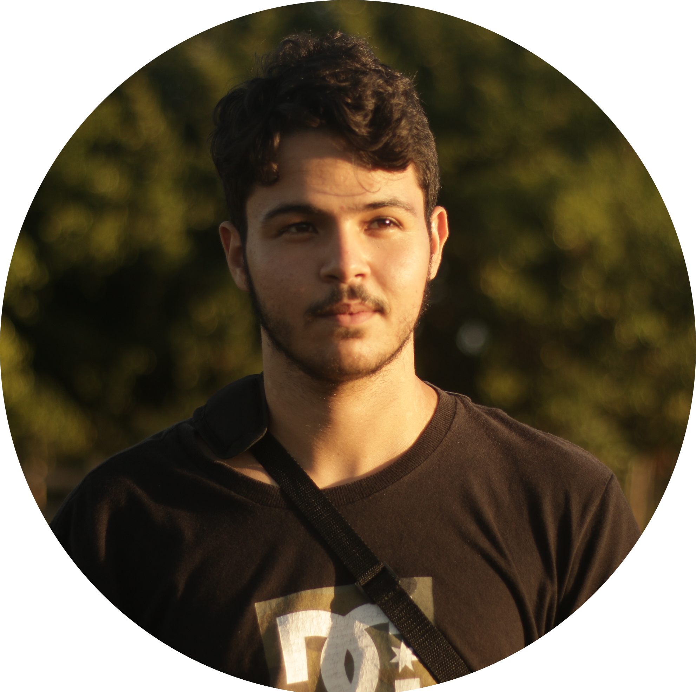

    

    

<h1><b> Hi there, I'm Pedro! </b> 👋 </h1>

<h3> - Brazilian 🏖️ full stack developer based in London 💂</h3>
<h3> - Industrial automation technician 🏭 </h3>
<h3> - Intrested in building everthing from robots to interfaces 🔧</h3>
<h3> - co-founder of <a href="https://prajaenvios.com.br">Pra Já - Envios</a> local platform for logistics ✈</h3>

<h3>- feel free to send me an email at pedrosantb@gmail.com<h3>

 
<h1> Blog posts </h1>

<!-- BLOG-POST-LIST:START -->
<!-- BLOG-POST-LIST:END -->
<h2>coming soon</h2>

 
<h1>My GitHub stats</h1>

 

<!--  -->

